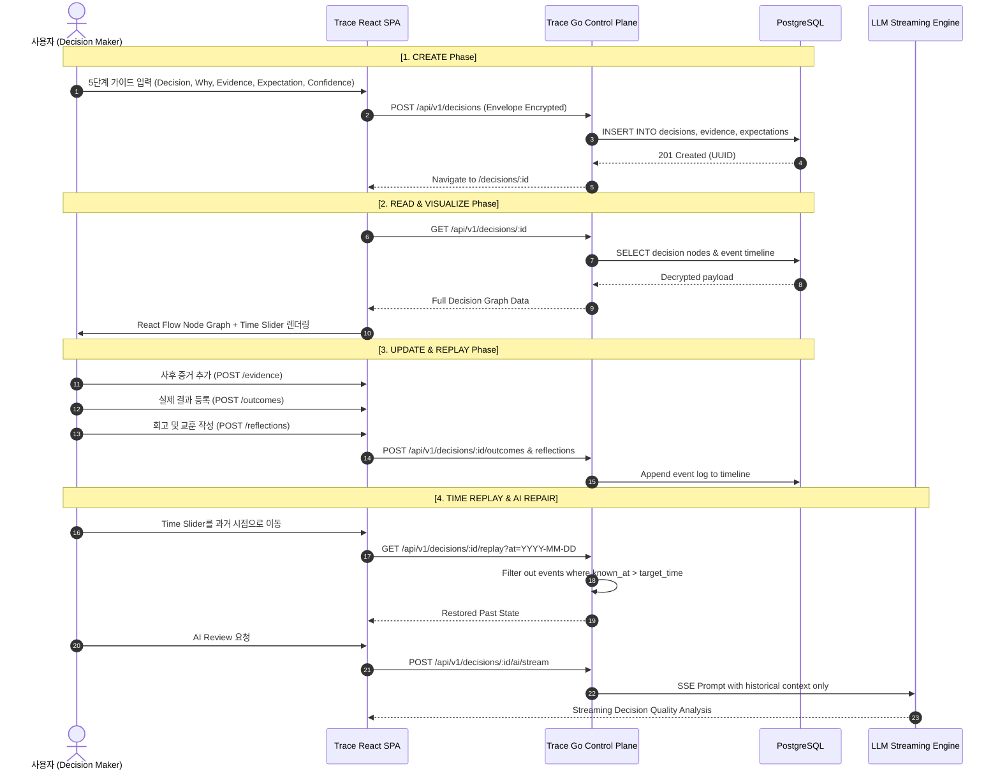

# Trace CRU (Create, Read, Update/Replay) 실무 매뉴얼

본 문서는 Trace 플랫폼에서 의사결정 수명주기 전반(생성 → 조회 및 시각화 → 업데이트 및 회고)을 수행하는 실무 시나리오와 데이터 흐름을 다룹니다.

---

## 1. CRU 아키텍처 및 데이터 흐름

---

## 2. 세부 단계별 실무 가이드

### Phase 1: Create (새로운 판단 남기기)
1. **의사결정 정의**:
   - `제목`: 검색과 추적이 쉬운 핵심 문구 (예: *Core Payment DB로 PostgreSQL 16 채택*)
   - `결론`: 행동 지침 및 결정 사항 요약
   - `결정 시점`: 실제 결정이 내려진 일시
2. **배경 논리 및 전제 (Why & Assumptions)**:
   - 선택 이유와 함께 실패 위험을 야기할 수 있는 숨은 전제조건(`Assumptions`)을 반드시 명시
   - 검토했던 대안(`Alternatives`)을 함께 저장하여 사후 대안 비교 지원
3. **근거와 앎의 시점 (`known_at`)**:
   - 증거 자료의 배포일이 아닌 내가 해당 사실을 인지한 시점을 명확히 기록
4. **기대치 및 반증 조건 (Expectation & Invalidation)**:
   - '어떤 지표가 달성되면 성공인가'와 더불어 **'어떤 지표가 발생하면 이 결정이 틀렸음이 입증되는가'**를 선행 선언
5. **확신 수준 (Confidence)**:
   - 0~100% 사이의 확신도를 슬라이더로 기록 (추후 사후 확신 편향 보정)

---

### Phase 2: Read (판단 구조 시각화 및 관찰)
- **Interactive Flow Graph**:
  - `Decision` 노드를 중심으로 좌측에는 판단의 발판이 된 `Evidence`가 실선 화살표로 연결됩니다.
  - 우측에는 선택되지 않은 `Alternatives`와 미래의 `Expectation`이 점선으로 표시됩니다.
  - 하단에는 확정된 `Outcome`이 활성 엣지로 동적 결합됩니다.
- **상세 패널**:
  - 당시의 확신 수준 게이지, 논리/전제 블록, 근거 카드 리스트, 검토 주기 알림 표시

---

### Phase 3: Update (사후 데이터 누적 및 회고)
- **사후 증거 추가**: 프로젝트 진행 중 새롭게 알게 된 사실이나 변경된 외부 환경을 추가 등록
- **결과(Outcome) 기록**: 프로젝트 완료 후 실제 달성된 성과 지표와 비즈니스 영향도 입력
- **회고(Reflection) 기록**:
  - `Reasoning Still Sound`: 당시의 논리가 사후에도 타당했는가?
  - `Key Learnings`: 조직/개인 차원에서 축적된 교훈 기록

---

### Phase 4: Decision Replay (시간 여행 및 판단 품질 분석)
- **미래 정보 제거 원칙**:
  - Time Slider를 판단 당시 일시로 되돌리면, 사후에 등록된 Outcome과 추가 증거가 데이터에서 완전히 사라집니다.
  - **"결과를 알고 있는 상태에서 과거를 비판하는 사후 확증 편향(Hindsight Bias)"**을 수학적/구조적으로 차단합니다.
- **AI Co-Pilot 협업**:
  - 과거 시점 컨텍스트만을 LLM 프롬프트에 주입하여, 당시 정보 수준에서 최적의 대안이었는지를 객관적으로 검토합니다.
