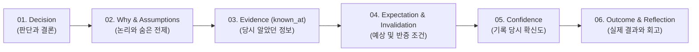
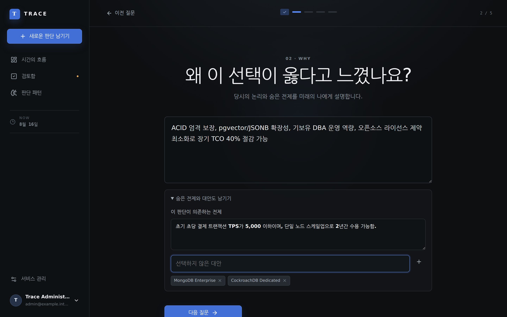
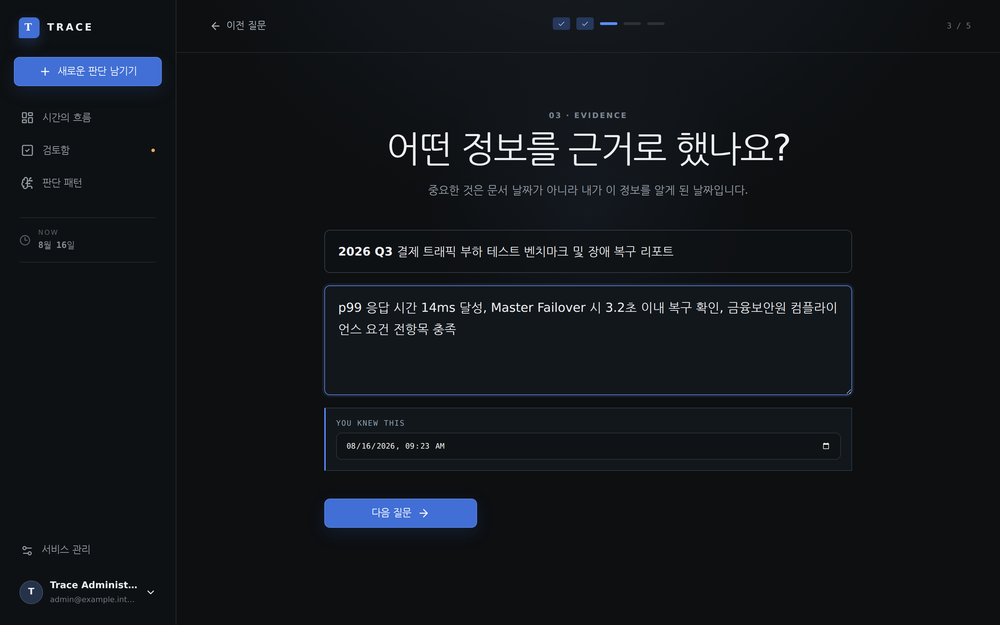
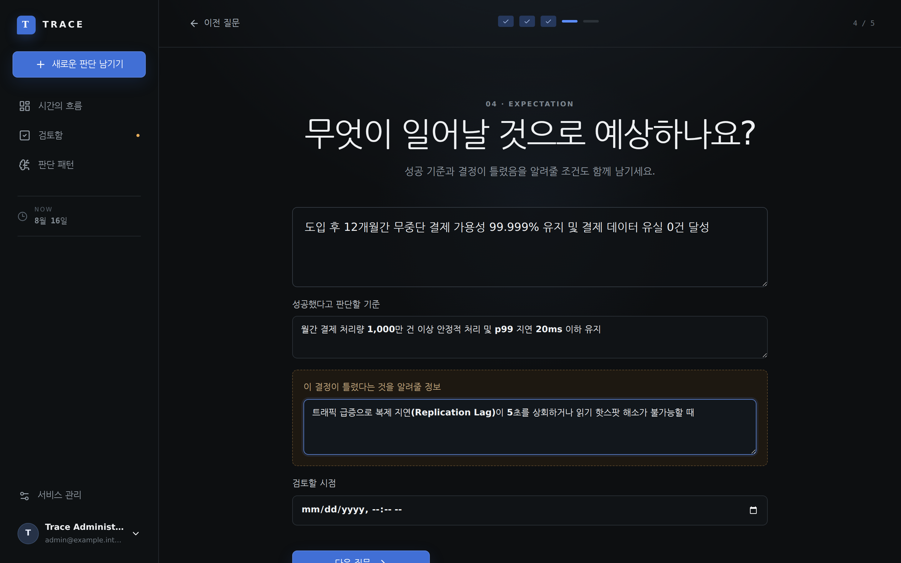
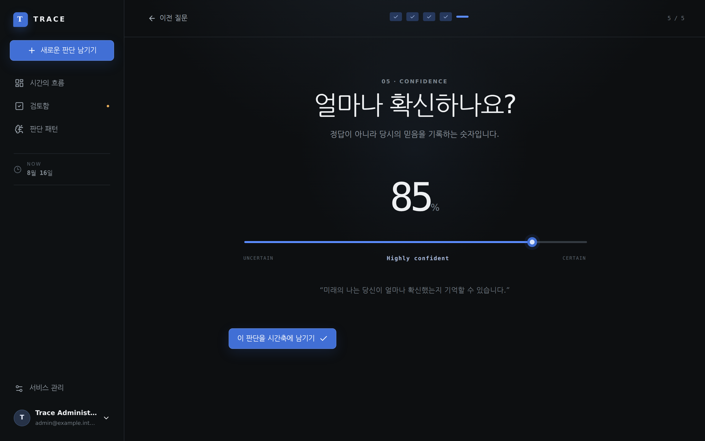
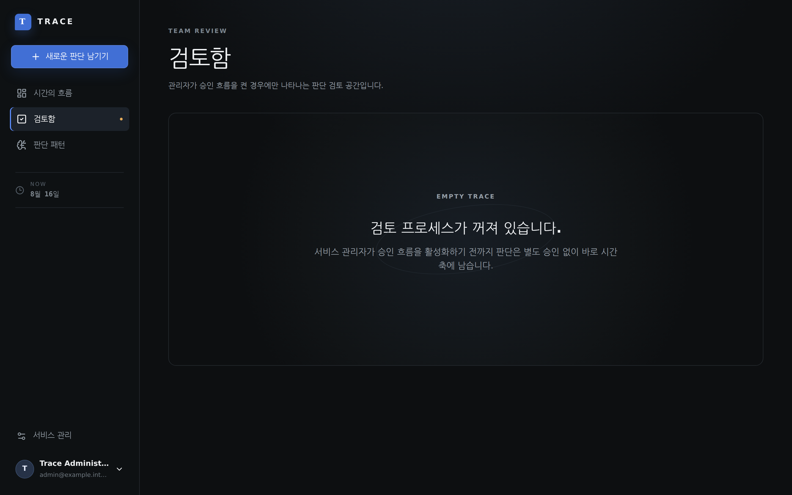
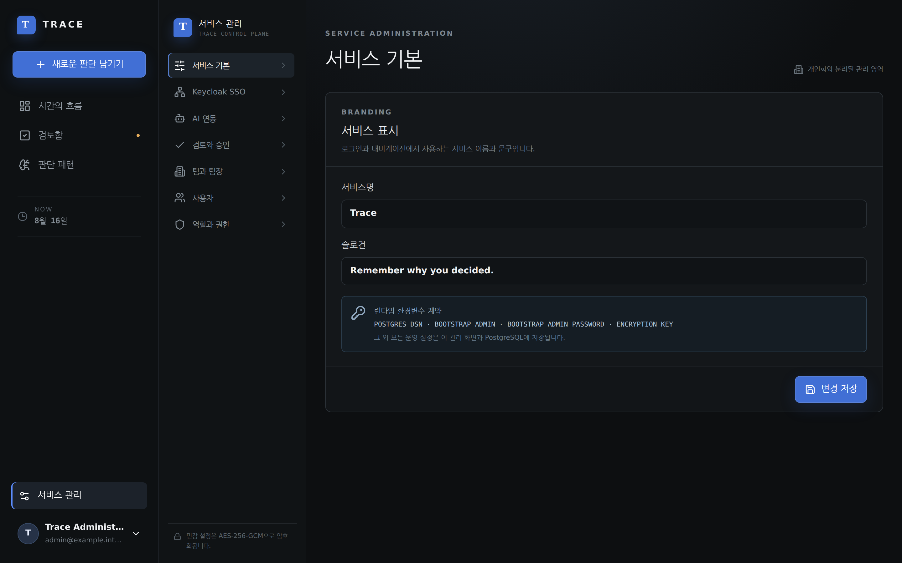

# Trace 사용자 가이드 (User Guide)

> **"결과가 아니라, 당시 알고 있던 정보와 판단의 품질을 기억하세요."**
> Trace는 의사결정 당시의 전제, 근거, 확신 수준을 시간축에 정확히 보존하고, 사후에 과거 시점으로 돌아가 판단 품질을 다시 평가하는 **Decision Intelligence Platform**입니다.

---

## 1. 핵심 개념 (Core Concepts)

1. **Decision (판단과 결론)**: 무엇을 결정했는지 명확하고 간결하게 기록합니다.
2. **Why & Assumptions (논리와 숨은 전제)**: 이 선택이 옳다고 느낀 이유와 선택하지 않은 대안(Alternatives), 그리고 내포된 전제조건(Assumptions)을 보존합니다.
3. **Evidence (known_at)**: 정보의 생성일자가 아니라 **'내가 이 정보를 알게 된 시점(`known_at`)'**을 기준으로 근거를 등록합니다.
4. **Expectation & Invalidation (예상과 반증 조건)**: 성공 기준과 함께 '이 판단이 틀렸음을 입증할 신호(Invalidation Condition)'를 선언합니다.
5. **Confidence (확신 수준)**: 사후 확증 편향을 방지하기 위해 결정 당시의 주관적 확신도(0~100%)를 기록합니다.
6. **Decision Replay (시점 복원)**: 미래에 추가된 결과와 정보를 백엔드에서 완전히 필터링하여, 당시 시점 그대로의 그래프와 데이터를 재현합니다.

---

## 2. 화면별 주요 기능

### 2.1 로그인 및 인증 (`/login`)

- **로컬 Bootstrap 관리자** 및 **Keycloak OIDC Discovery/PKCE SSO** 연동 지원
- Envelope Encryption 키 기반 사용자별 데이터 암호화
- 오프라인 단독 구동 및 커밋/버전 태그 표시

### 2.2 시간의 흐름 / 홈 대시보드 (`/`)

- 진행 중인 의사결정 타임라인 및 상태별(Active, In Review, Completed) 분류
- 빠른 판단 남기기 및 팀별 의사결정 피드 제공

### 2.3 5단계 판단 입력 흐름 (CRU: Create)
| 단계 | 화면 | 핵심 입력 항목 |
| :--- | :--- | :--- |
| **01. Decision** |  | 판단 제목, 결론 본문, 카테고리, 결정 시점, 팀 배정 |
| **02. Why** |  | 선택 이유, 숨은 전제(Assumptions), 비선택 대안(Alternatives) |
| **03. Evidence** |  | 근거 제목, 신뢰도, 지지/중립/반대 방향, You Knew This (`known_at`) 시점 |
| **04. Expectation** |  | 기대하는 미래, 성공 기준, 반증 신호(Invalidation), 검토 시점 |
| **05. Confidence** |  | 0~100% 확신 수준과 새 판단에 개입하는 과거 유사 Decision |

### 2.4 인터랙티브 디시전 그래프 & 시점 복원 (`/decisions/:id`)

- **React Flow 기반 시각화**:
  - `Decision` 노드 (중앙)
  - `Evidence` 노드 (좌측, 실선)
  - `Expectation` & `Alternatives` 노드 (우측, 점선)
  - `Outcome` 노드 (하단, 애니메이션 엣지)
- **Time Slider & Decision Replay**:
  
  - 하단 슬라이더를 과거로 이동하면 미래에 발생한 Evidence, Outcome, Reflection이 그래프와 상세 패널에서 자동으로 숨겨집니다.

### 2.5 사후 데이터 업데이트 및 회고 (CRU: Update)
- **근거 추가**: 사후에 새롭게 알게 된 사실을 추가로 시간축에 바인딩
- **결과 기록 (Outcome)**: 실제 발생한 결과와 판단 품질(Decision Quality) 점수 입력
- **회고 (Reflection)**: 당시 논리가 타당했는지, 어떤 교훈을 얻었는지 기록
- **Decision Version**: 본문을 수정할 때 변경 이유와 새 버전을 만들고 이전 상태를 보존
- **Confidence History**: 확신이 바뀐 값과 이유를 시간축에 기록
- **Assumption Tracker**: `UNKNOWN → ACTIVE → STRENGTHENED/WEAKENING/BROKEN` 상태 변화 추적
- **Invalidation Signals**: 사전에 정의한 반증 조건의 발동과 해소 근거 추적

### 2.6 Decision Network와 Memory (`/graph`, `/search`)

- Focus Graph는 선택한 Decision 주변 1-hop만 먼저 보여주며 사용자가 원할 때 2-hop을 엽니다.
- 관계는 `DEPENDS_ON`, `CAUSED_BY`, `FOLLOW_UP`, `REPLACES`, `SUPPORTS`, `CONFLICTS_WITH`, `RELATED_TO`를 지원합니다.
- Zoom에 따라 점 → 제목/상태 → 확신/결과 순으로 정보가 나타나며 날짜와 분류로 Graph를 필터링할 수 있습니다.
- Memory Search는 자연어 질문으로 Decision, Reason, Evidence, Outcome, Reflection을 검색합니다. AI 연결이 없어도 로컬 검색이 동작합니다.
- Replay mode에서 `THEN ↔ NOW`를 실행하면 두 시점의 버전·확신·Evidence·전제 차이가 함께 표시됩니다.

### 2.7 판단 패턴 및 인텔리전스 분석 (`/insights`)

- **Skill vs Luck vs Mistake 매트릭스**: 좋은 판단+좋은 결과(Skill), 나쁜 판단+좋은 결과(Dumb Luck), 좋은 판단+나쁜 결과(Bad Break), 나쁜 판단+나쁜 결과(Mistake) 분류
- 평균 확신도, 근거 깊이(Evidence Depth), 회고율 통계
- 확신 구간별 실제 성공률 Calibration, Category별 Bias Profile, 반복 Pattern, Personal Decision Profile
- AI Pattern Intelligence는 여러 Decision을 함께 읽되 관찰과 가설을 구분해 스트리밍으로 표시

### 2.8 검토 및 승인 (`/reviews`)

- 모든 사용자는 결과/검토일, 높은 확신, 새 Evidence, 위험 전제, 장기 미검토, 반증 발동을 반영한 개인 Review Inbox를 사용합니다.
- 팀장 승인·반려 영역은 관리자가 승인 workflow를 활성화한 경우에만 별도로 나타납니다.

### 2.9 관리자 콘솔 (`/admin`)

- 서비스 브랜딩 및 로고
- Keycloak OIDC SSO 설정
- OpenAI / 호환 LLM 스트리밍 연동
- 선택적 Embedding model과 실패 시 오프라인 로컬 Memory fallback
- Envelope Encryption 암호화 키 관리 및 회전
- 역할 기반 접근 제어(RBAC)
